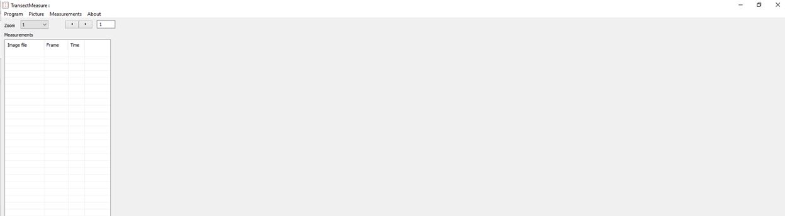

# forward-facing-habitat-annotation

This github repository contains scripts to convert the exports from [TransectMeasure](seagis.com.au) into percent cover of benthos and mean and SD of relief.

### TransectMeasure

The annotation schema has been applied using the TransectMeasure software from [seagis.com.au](http://www.seagis.com.au/) and the rapid assessment attribute text file  (Supp 10) or the [det](https://github.com/TimLanglois/HabitatAnnotation/blob/master/TM%20schema_BROAD.MORPH.TYPE.with%20Invert%20Complex_170619.txt)ailed assessment attribute text file (Supp 11).

#### Load images and attribute file
*   Open the program **TransectMeasure **and you will be welcomed with a blank screen (Figure 2).

 **Figure 2:**  Screen capture from TransectMeasure.

*   To start an analysis for a new set of images: “Measurement” > “New measurement file” (Figure 3). Select “Read from file ...”.

 **Figure 3:**  Screen capture from TransectMeasure. 

*   Locate the folder where your images have been stored: “Picture” > “Set picture directory ...” (Figure 4).

 **Figure 4:** Screen capture from TransectMeasure.

*   Load the first image to be analysed: “Picture” > “Load picture ...” (Figure 4).
    *   Retake habitat images if they are unfocused and blurry or when visibility is low.
*   To load the attribute file containing all of the CATAMI habitat classification codes: “Measurements” > “Load attribute file ...” > The attribute file is a text file containing the information necessary for populating the drop down tabs when classifying your image (Figure 5).

 **Figure 5:** Screen capture from TransectMeasure.

#### Setting and overlaying the grid
*   To set up the grid: “Measurements” > “Dot configuration ...”. Set accordingly: Gridded dots, ‘Dots across image’ = 5, ‘Dots down image’ = 4 and check the “Overlay rectangles” box (Figure 6). This will allow you to classify the habitat according to a 4 x 5 grid composed of 20 ‘rectangle’s. You should only need to change these settings the first time you use the program on your computer.

 **Figure 6:**  Screen capture from TransectMeasure.

*   To overlay the grid: Right click on an image and select “Overlay dots” (Figure 7). The name of the image will then appear in the table to the left of the image (Figure 8).

**Figure 7:**  Screen capture from TransectMeasure.

**Figure 8:**  Screen capture from TransectMeasure.

#### Classifying the habitat in an image
*   Left click on a point in the middle of a ‘rectangle’ to display the “Attribute editor” (Figure 9)

**Figure 9:** Screen capture from TransectMeasure.

*   Select the most dominant habitat from the “BROAD” dropdown (includes benthos, un/consolidated substrate, “Open water” and “Unknown”) in the ‘rectangle’ that you selected, independently of all others in the grid (i.e. do not look across the whole image and decide that hard coral makes up at least one rectangle).

Note: For a ‘rectangle’ with “Open water” - you should annotate ANY benthos within the 'rectangle'. 'Rectangle's should only be annotated as “Open water” if they are 100% “Open water”.

Note: Zoom into an image to analyse the habitat more closely by adjusting the "Zoom" value at the top left of the window before holding down the ctrl key and hovering your cursor over the area of interest.

*   Continue to populate each dropdown (where possible) after “BROAD” (i.e. “MORPHOLOGY” > “TYPE” > _FieldOfView_ > _Relief_). The “MORPHOLOGY” and “TYPE” drop down options will change depending on which “BROAD” option is chosen . Select “Clear” to reset the dropdowns for all of the categories (Figure 10).
*   The dropdown for “Code” is automatically filled by an eight digit code once all possible categories have been selected for that 'rectangle'. Codes are sourced from the CATAMI classification scheme and are dependent on the combination of the first three options selected (i.e. “BROAD”, “MORPHOLOGY” and “TYPE”). 

**Figure 10:** Screen capture from TransectMeasure.

*   Continue to classify each 'rectangle' in the image until all 20 have been classified. To find any points not classified across one or all images classified: “Measurements” > “Show images with missing label attributes”.
*   To easily access the next image to be classified: Select the arrow going forward in the box in the top left of the window. This may not work when the images have not been labelled in a numerical sequence. If this is the case, load the next image by going back to “Picture” > “Load picture ...”.

#### Saving and exporting from TransectMeasure
*   To save your work: “Measurements” > “Write to file ...” (Figure 11). This creates a *.TMObs file where your habitat classifications will be saved.

**Figure 11::** Screen capture from TransectMeasure.

*   To export TMObs file: i. “Program” > “Batch text file output ...”

**Figure 12:** Screen capture from TransectMeasure.

*   The following box should appear: Double click to the right of the ✓ (under “Data”) in the “Input file directory” row, then locate the folder where your *.TMObs file has been saved, do the same for the “output file directory” to specify the folder location for saving your text file (Figure 13). Now select “Process”.

**Figure 13:** Screen capture from TransectMeasure.

*   Now you can use the R scripts provided to produce a tidy data set of percent cover and mean and standard deviation of relief for each sample.